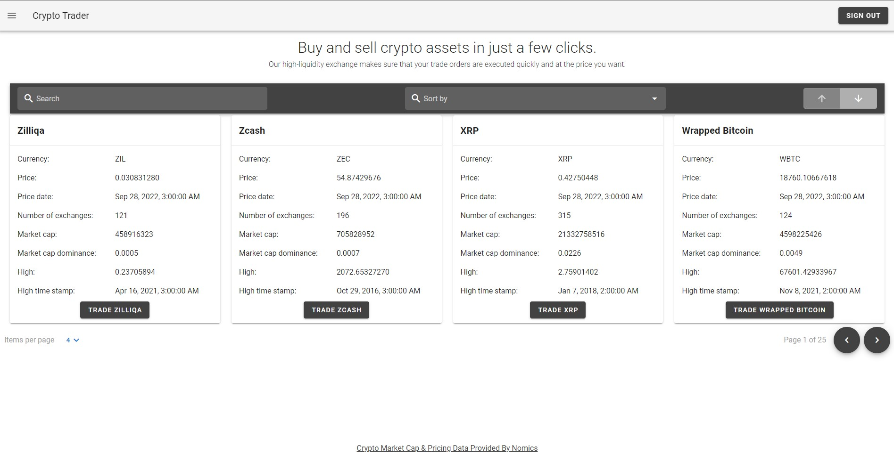
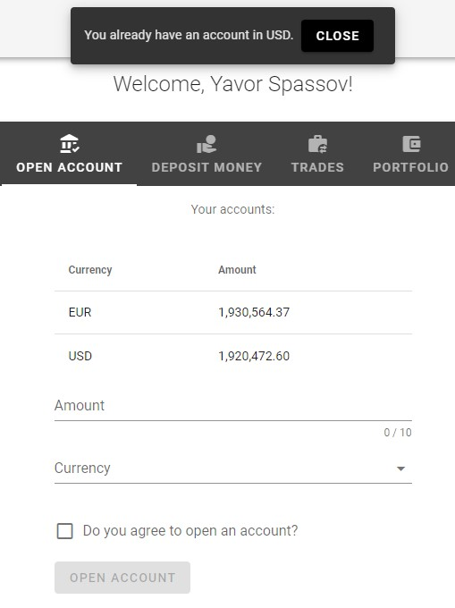
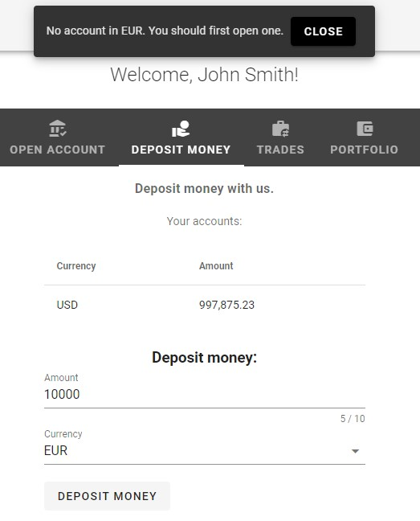
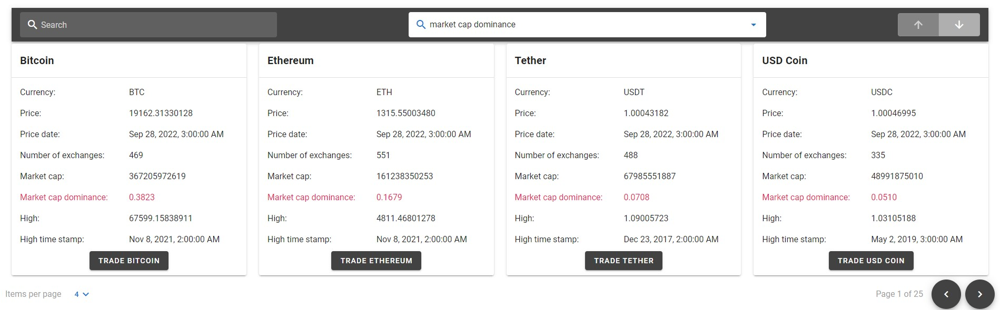

# Crypto Trader

> A VueJS application for trading cryptocurrencies.
> Live demo [_here_](https://crypto-trader-43311.web.app/).

## Table of Contents

- [General Info](#general-information)
- [Technologies Used](#technologies-used)
- [Features](#features)
- [Setup](#setup)
- [Usage](#usage)

## General Information

The project serves as a platform for trading cryptocurrencies. It is only meant as a portfolio project and while the cryptocurrency data it displays is real and is updated in real time, the money and the trade operations that take place are fake. To that end, ofcourse, there is no payment system integrated. Anyone is free to deposit as much money in USD and EUR as he wishes. If you're short on money and can't conduct certain operation, just deposit more.

The cryptocurrency data for the project is provided from [Nomics] (https://nomics.com/) - the largest crypto index.

## Technologies Used

[VueJS](https://vuejs.org/) -the progressive JavaScript framework
[Vue Router](https://router.vuejs.org/) - the official router for VueJS
[Vuetify](https://vuetifyjs.com/en/) - a Vue UI Library
[Pinia](https://pinia.vuejs.org/) - the official store library for Vue
[Firebase](https://firebase.google.com/) - an app development platform
[moment](https://momentjs.com/) - a JavaScript library for parsing, validating, manipulating and displaying date/time
[uniqid](https://www.npmjs.com/package/uniqid) - a unique ID generator

## Features

List the ready features here:

- Opening an account:
  You can open an account in either USD or EUR. If you already have an account in the currency you're currently trying to open an account in, you receive a warning, as seen on the screenshot below, and the action is canceled.
  
- Deposit money:
  If you already have an existing account, you can deposit money in that account's currency. Otherwise, a popup will prompt you that you must open an account, and the action will be canceled:
  
- Sort and search:
  Apart from searching and visualising only the cryptocurrencies of your interest, you can also sort them by any of the fields a single cryptocurrency presents as seen on the screenshot:
  

## Setup

## Usage

`code`
