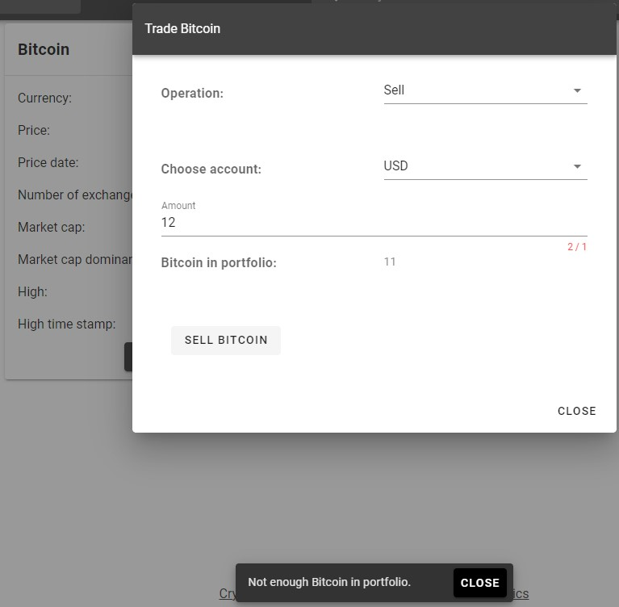
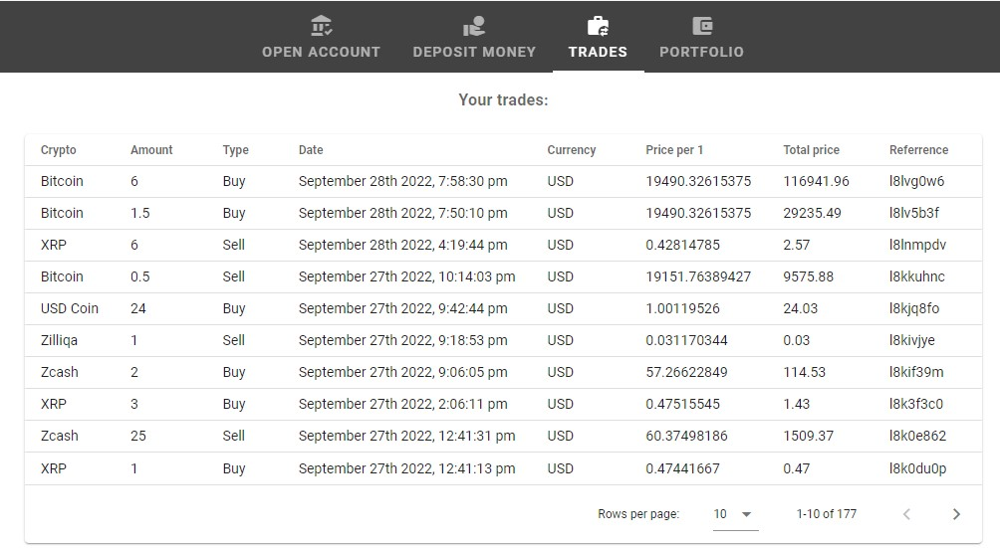
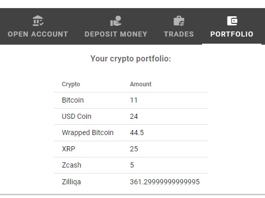
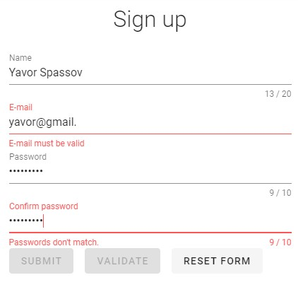

# Crypto Trader

> A VueJS application for trading cryptocurrencies.
> The live project: [_here_](https://crypto-trader-43311.web.app/)

## Table of Contents

- [General Info](#general-information)
- [Technologies Used](#technologies-used)
- [Features](#features)
- [Reporting](#reporting)
- [Authentication](#authentication)
- [Setup](#setup)
- [Usage](#usage)

## General Information

The project serves as a platform for trading cryptocurrencies. It is only meant as a portfolio project and while the cryptocurrency data it displays is real and is updated in real time, the money and the trade operations that take place are not. To that end, of course, there is no payment system integrated. Anyone is free to deposit as much money in USD and/or EUR as he wishes. If you're short on money and can't conduct certain operation, just deposit more.

The app is hosted on Firebase.

The cryptocurrency data for the project is provided by [_Nomics_](https://nomics.com/) - the largest crypto index.

## Technologies Used

[VueJS](https://vuejs.org/) -the progressive JavaScript framework

[Vue Router](https://router.vuejs.org/) - the official router for VueJS

[Vuetify](https://vuetifyjs.com/en/) - a Vue UI Library

[Pinia](https://pinia.vuejs.org/) - the official store library for Vue

[Firebase](https://firebase.google.com/) - an app development and hosting platform

[MomentJS](https://momentjs.com/) - a JavaScript library for parsing, validating, manipulating and displaying date/time

[Uniqid](https://www.npmjs.com/package/uniqid) - a unique ID generator

## Features

- Opening an account:

  You can open an account in either USD or EUR. If you already have an account in the currency you're currently trying to open an account in, you receive a warning, as seen on the screenshot below, and the action is canceled.

  

- Depositing money:

  If you already have an existing account, you can deposit money in that account's currency. Otherwise, a popup will prompt you that you must open an account, and the action will be canceled:

  

- Sorting and searching:

  Apart from searching and visualizing only the cryptocurrencies of your interest, you can also sort them by any of the fields a single cryptocurrency presents as seen on the screenshot:

  

- Trading:

  Each cryptocurrency comes with a button that opens a trade popup window. It allows you to choose the type of operation you would like to conduct (Buy/Sell) with that crypto and the account you would like to use for the operation (USD/EUR).

  On successful operation, you see a message indicating how much crypto of the certain type you have purchased. Otherwise, you receive a warning that something has gone wrong as it is in the case below and the trade action is cancelled. In this example, you see that the amount of Bitcoin you try to sell (11) exceeds the amount you currently have in your portfolio (12). Another reason for a trade operation to be cancelled could be that you don't have the money in your USD or EUR account to conduct it or you simply don't have an open account in that particular currency. In either case, a warning will appear, notifying you exactly what has gone wrong.

  A successful trade operation will update both the account you've chosen for the trade and the amount of crypto in your portfolio. Reports of past trade operations are also available.

  

## Reporting

It is based on the trade operations and consists of two types:

- Trade operations

  Each purchase or sale results in a trade operation consisting of the type of crypto being sold, the amount, the type of operation, the price, a unique id that serves as a transaction reference and so on. The data saved/read from Firebase is conviniently presented in the table below:

- Portfolio

  Portfolio reports present a smaller table consisting only of the type of crypto available in the trader's portfolio and the quantity against it:

Both reports are instantly updated after a successful trade operation.

## Authentication

The application uses Firebase authentications and Vuetify form validation:

Trading and dashboard access is only available to signed in users.

Individual trader's login credentials are also stored in his browser so that he can automatically login after browser refresh or even pc restart without the need to manually sign in.

## Setup

- To install dependencies:

`npm run install`

- To run the project locally:

`npm run serve`

## Usage

The usage is simple and straightforward. You sign up and sign in from the hamburger menu in the top left corner. Then, you go for opening accounts in USD and EUR, and continue with trade operations as seen on the screenshots.
